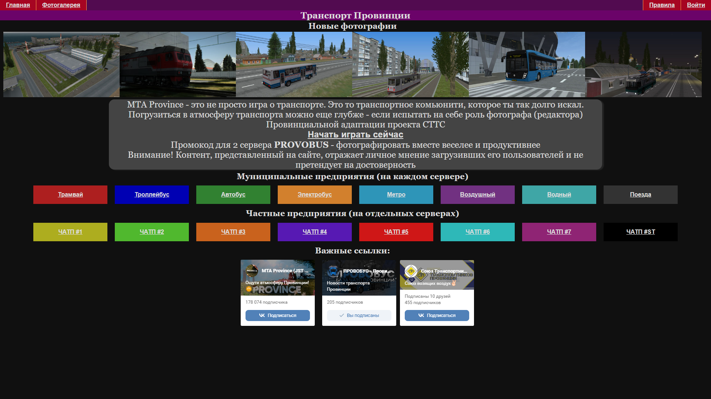

# Провобус - Транспорт Провинции
*Адаптация проекта СТТС "Трансфото" для транспорта игры МТА Провинция*
Установка:
1. Скачать PyCharm
2. Скачать MariaDB
3. Клонировать проект в рабочую папку
4. Импортировать файл базы данных .sql, в файле myproject.py изменить DataBasePassword
5. Установить библиотеки, на которые заругается компилятор, через PIP
6. Запускать wsgi.py

